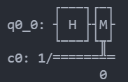

# Truly-Random

Our world is literally fuelled by random numbers. We use random numbers in Cryptography, Blockchain, Statistics, Gaming, and Gambling. However, classical methods of producing random numbers aren't truly 'random' as such and they rely on ever changing seeds and algorithms that imitate randomness. With the advent of Quantum Computing, all this is going to change, as Quantum Phenomena are fundametally random. In this project we use IBM's qiskit library to simulate a mini Quantum Computer and generate numbers that bring us closer to the dream of generating True Random Numbers!

### Deployed on:

https://trulyrandom.herokuapp.com/

### Installation (from Scratch):

Install the virtualenv module using pip

    mkdir environments
    cd environments
    virtualenv myenv
    .\myenv\Scripts\activate.bat
    pip install -r requirements.txt

Initialize the project folder as a git repository

    git init
    git add .
    git commit -m “Project Commit”

Install the Heroku Toolkit

    heroku login
    heroku create
    heroku rename trulyrandom
    git push heroku master

For errors, use the logs to debug

    heroku logs --tail 

### Theory

Most random number generators actually generate pseudorandom numbers, which rely on specific classical algorithms. The best alternative is an RNG that depend on atmospheric noise or thermal effects. Cryptography uses Cryptographically secure pseudo RNGs that rely on keys with high entropy. This project demonstrates that we can generate true random numbers by running the python scripts on a fault tolerant Quantum Computer.
We first initialize a quantum register and a classical register, both with a size of 1 bit. Then we load both registers into a single circuit.

After that, we pass the quantum register as an argument to the Hadamard Gate. This gate takes a single qubit as its input and returns a number that is either 0 or 1, with equal probability. It does this by creating a superposition, which ultimately collapses to one of the two states. Then we 'measure' the quantity in the quantum register and store that in the classical register. This entire procedure has been described as a 'Coin Toss'.
By repeating this coin toss over and over again, we can generate a string of binary digits, integers, floating point numbers and more!

 

<u>Original Repo:</u>
 
https://github.com/Chasmiccoder/Truly-Random

### Resources

<a href="https://qiskit.org/documentation/index.html">Qiskit Documentation</a>
  

Background Images by  
<a href="https://pixabay.com/users/insspirito-1851261/?utm_source=link-attribution&utm_medium=referral&utm_campaign=image&utm_content=1280081">Garik Barseghyan (insspirito)</a>
 
<a href="https://pixabay.com/users/thedigitalartist-202249/?utm_source=link-attribution&utm_medium=referral&utm_campaign=image&utm_content=1147253">Pete Linforth</a>
 
<a href="https://pixabay.com/users/elchinator-10722855/?utm_source=link-attribution&utm_medium=referral&utm_campaign=image&utm_content=4711302">Elchinator</a>
 
<a href="https://pixabay.com/users/lumina_obscura-4128746/?utm_source=link-attribution&utm_medium=referral&utm_campaign=image&utm_content=3608029">Lumina Obscura</a>
 
<a href="https://pixabay.com/users/wikiimages-1897/?utm_source=link-attribution&utm_medium=referral&utm_campaign=image&utm_content=74005">Deutsch</a>
 
